# dp-desktop-app

This project is part of the [Machine Learning Data Platform (MLDP)](https://github.com/osprey-dcs/data-platform).  This repo contains a Java desktop application that provides a user interface for navigating Process Variable (PV) time-series data and metadata in the MLDP archive, viewing and creating annotations, and other tools for visualizing, exporting, and importing data.  The application uses the MLDP gRPC API and provides a useful reference for calling those APIs from a Java client.

#### Developer notes

I needed to complete the initial version of this application in about two weeks, so I decided to try to generate as much of the GUI code as possible using the Claude AI agent.  I created a project document [SPECIFICATIONS.md](./SPECIFICATIONS.md) that included a "Development Plan" where I incrementally laid out tasks for Claude to complete.  In the end, the agent generated pretty much all the GUI code. I'm pretty happy with the result. Claude does surprisingly well on large tasks like creating a new view from scratch, but seems to get lost in the weeds sometimes trying to fix bugs or change subtle behaviors.  Each task that we completed, I asked Claude to update the [CLAUDE.md](./CLAUDE.md) document, which is a good source of information for technical details and patterns used in the application, etc.

#### Document organization

The remainder of this document is orgzanized in two parts 1) installing and running the desktop application and 2) using the application to learn more about the MLDP features.

## Installing and running the application

#### Prerequisites

MongoDB is the only prerequisite for using the application, either as an installed package or via docker.  See the [data-platform installation instructions](https://github.com/osprey-dcs/data-platform/blob/main/doc/user/installation.md#mongodb-installation) for more details about installing MongoDB.

#### Installation

The easiest way to install the application is via the data-platform installer.  Download the installer archive to your local machine and extract the archive.  The installer can be found in the "Assets" section for the [latest data-platform release](https://github.com/osprey-dcs/data-platform/releases/latest).  See these links for more information about 1) [downloading the installer](https://github.com/osprey-dcs/data-platform/blob/main/doc/user/quick-start.md#download-and-extract-data-plaform-installer) and 2) [configuring the environment](https://github.com/osprey-dcs/data-platform/blob/main/doc/user/quick-start.md#create-data-platform-environment-config-file).

#### Running the Application

The initial version of the application runs only in "demonstration mode".  Support for MLDP services running as remote gRPC targets will be added in the next release.

To simplify the environment required to run in demonstration mode, the desktop application includes the MLDP service implementations running in the same process as the GUI, which communicates with the services via the "in-process" gRPC framework.  By default, the application uses a Mongo database called "dp-demo".  This avoids the need to run the MLDP services as separate Java applications, and data created by the demo application is not added to the production Mongo database.  The Mongo dp-demo database is reset each time the application runs, so any data saved during a session is lost the next time the application is run.

To run the application, change to the installation's "bin" directory and run the "app-run-desktop-app" script, e.g., 

```
cd ~/data-platform/bin
./app-run-desktop-app
```

The application window is opened and the application log messages appear in the command console.

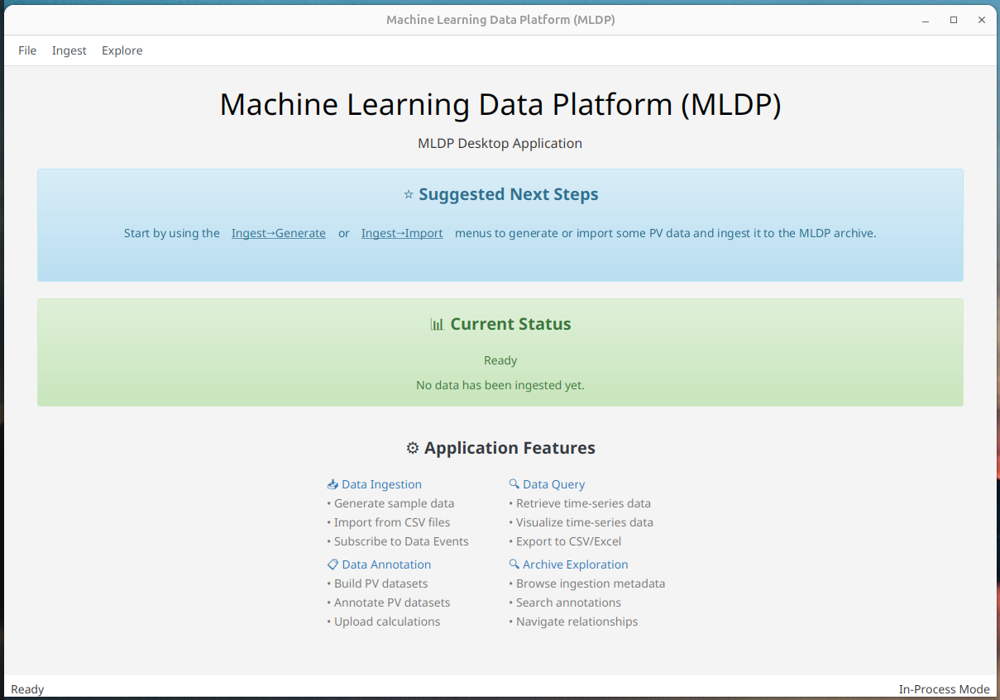

## Using the application

Instead of providing a Reference Manual for the application, this section uses concrete examples to demonstrate various features of the MLDP API.  It is organized into four subsections: 1) ingesting PV time-series data to the archive, 2) querying PV time-series data, 3) annotating archive data, and 4) exploring the archive.  

The remaining sections walk through a workflow demonstrating the following features:

- ingesting random PV time-series data
- querying and visualizing PV time-series data
- building, annotating, and exporting a Dataset
- exploring PV and Provider details
- searching Datasets and Annotations
- viewing Data Events generated by subscriptions

### Ingesting PV time-series data

While the MLDP Ingestion API supports both continuous streaming of PV time-series data and batch loading of data, this GUI application focuses only on batch loading of data either by generating and ingesting random PV data, or by importing PV data from Excel files.

The application supports ingesting randomly generated PV time-series data as well as data imported from an Excel spreadsheet.  The Ingest->Generate and Ingest->Import menu items are used for navigating to the views, respectively.

Both views for ingesting data utilize common elements for specifying details about the Data Provider, Ingestion Request, and Data Event Subscriptions, in addition to controlling the generation or import of PV time-series data.  Each element is described in more detail below.

#### Data Provider Details

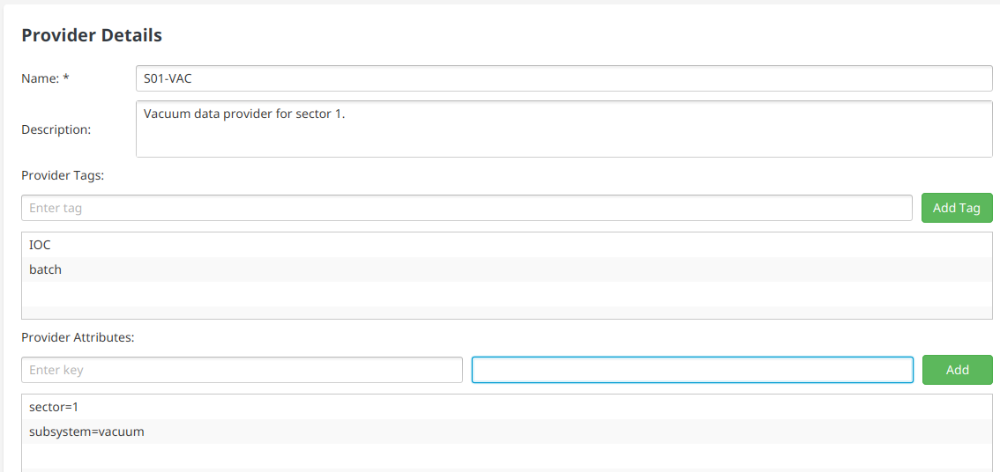

Each ingestion request must include the unique id of a "Data Provider".  The API method registerProvider() is used to register a Provider and obtain the unique id.  The demo application's ingestion view's require Provider Details for each ingestion request.  The form element for specifying Provider Details is shown above.  The Provider "Name" field is required.  The optional "Description", "Tags", and "Attributes" fields are used to specify additional information about the Provider including descriptive text, a list of keywords, and key-value attribute pairs, respectively.  Descriptive information is stored in the database as attributes of the Provider, which can later be used in searching for Providers.

#### Request Details

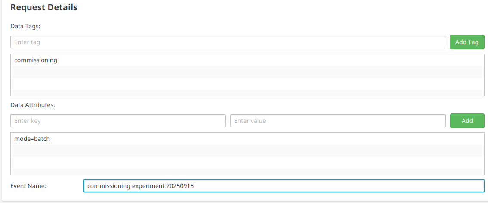

The ingestion forms include a section for capturing descriptive information that is attached to the PV time-series data "Buckets" generated for the request nd stored in the database, and is therefore retrieved along with that Bucket data when it is accessed from the database.

The section is labeled "Request Details" and includes optional fields for specifying "Tags", "Attributes", and "Event Name".

#### Generation Details (for random PV data)

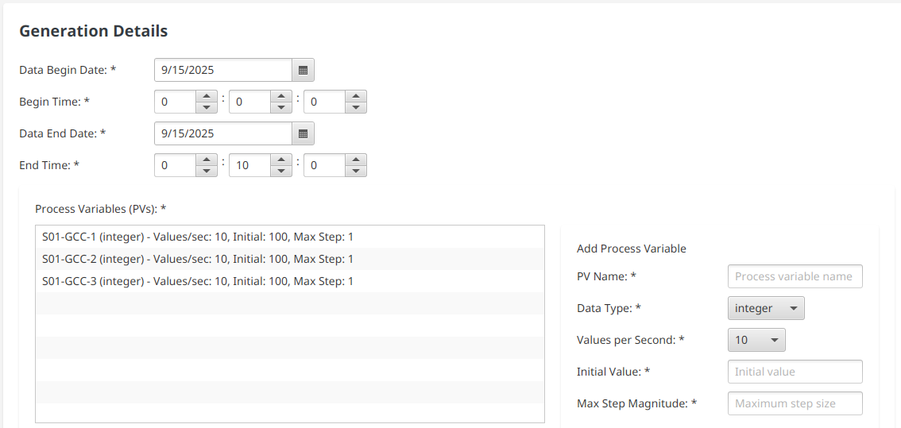

The "Generate Time-Series Data" view includes a section labeled "Generation Details".  It includes elements for specifying a date/time range for the data, a form for entering information about the PVs for which data will be generated, and a list for displaying those PVs.  Minimally, the request must include a time range and details for one or more PVs.  When entering PV details in the "Add Process Variable" form, hitting tab or return on the last field will add the PV details to the "Process Variables" list.  The list includes a context menu for removing items.

The "Generation Details" section shown above will generate data for 3 PVs over a 10-minute time range starting at midnight on 9/15/25. Each PV is specified to be an integer sampled at 10 values per second with initial value of 100 varying by a maximum value of 1 for each sample.

#### Import Details (for imported PV data)

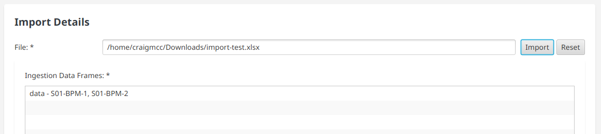

The "Import Time-Series Data" view includes a section labeled "Import Details" for selecting the Excel file to be imported.  To import an Excel file, click the "Import" button and choose the appropriate file from the file chooser dialog that opens after clicking the button.  The selected file is read, and validated to be of the proper format, and data for the PV columns is imported.  The expected file format for each sheet in the Excel file includes 2 timestamp columns with one for epoch seconds and the other for nanoseconds plus an additional data column for each PV to be imported with values for each timestamp.  The "Ingestion Data Frames" list box includes a row for each sheet read from the Excel file, showing the sheet name and the name of each PV data column.  The "Reset" button is used to clear the data for the imported file.

The "Import Details" screenshot above shows that the file "import-test" has been imported, which contained a single sheet called "data" with two PV data columns for "S01-BPM-1" and "S01-BPM-2".  Note that the "Import" button only reads the data from the file, it is not ingested to the archive until the "Ingest" button at the bottom of the view is clicked.

#### Data Event Subscription Details

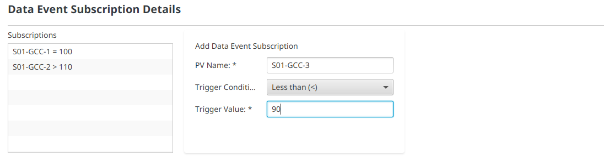

The MLDP provides a "Data Event" subscription mechanism so that the caller can optionally request to receive notification of Data Events for PVs when a particular condition is triggered by the data for that PV.  The "Data Event Subscription Details" section includes a form for adding subscriptions with fields for "PV Name", "Trigger Condition" (=, >, >=, <, <=, etc), and a trigger data value.  It also includes a list of Subscriptions, each with a context menu for removing the item from the list.

The screenshot above shows subscriptions for each of the three PVs each using a different trigger condition operator.  The subscribeDataEvent() API method is separate from the data ingestion APIs.  In practice, the client subscribing to data events would probably not be the same client that submits the data.  In this demo application, data event subscription is included in the ingestion views for convenience.  Later, we'll see how to view the data events triggered by the ingested data.

#### Initiating Data Ingestion

Both ingestion views include buttons at the bottom of the view for initiating data ingestion.  On the "Generate Time-Series Data" view, the button is labeled "Generate".  On the "Import Time-Series Data" view, the button is labeled "Ingest".

Initiating ingestion results in multiple API method calls.  The registerProvider() method is called to register the specified Provider name.  The ingestData() method is called one or more times depending on the properties of the data being ingested.  The subscribeDataEvent() method is called for each subscription specified in the "Data Event Subscription Details" section.

Database artifacts created will include a ProviderDocument in the "providers" collection for the Provider, BucketDocuments in the "buckets" collection containing bucketed time-series data for the specified PVs, and RequestStatusDocuments in the "requestStatus" collection with details about each individual ingestion request.

The screenshot below shows the home view after ingesting data.  It includes suggested next steps and details about the PV data ingested to the archive.

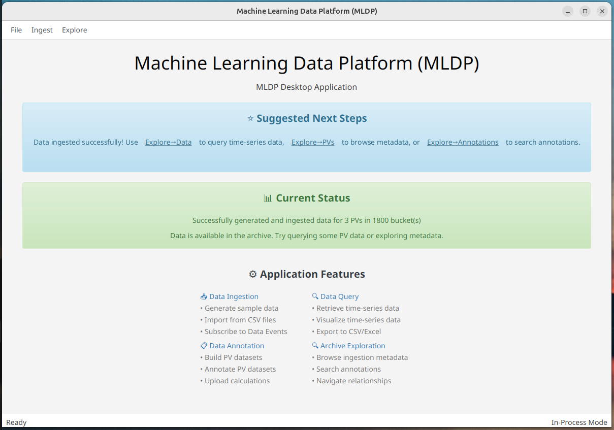

### Querying PV time-series data

The application includes a simple Query Editor and Data Viewer for retrieving and visualizing PV time-series data.  Use the Explore->Data menu item to navigate to the view "Data Explorer" view that contains them.

The Query Editor includes a list of "PV Names" and date/time range for the query.  After ingesting data using either the generation or import data ingestion views, the list of PV Names and time range is prepopulated with the values from the ingestion view.  The screenshot below shows the Query Editor prepopulated with PVs and time range from the ingestion example above.

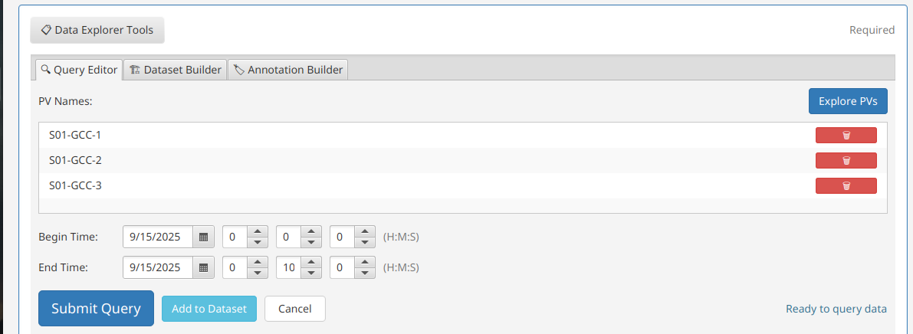

Each item in the list of "PV Names" includes a trash can button for removing the name from the list.  The "Explore PVs" button is used to add more PVs to the list, as we'll see later.  Click the "Submit Query" button to execute the query and display the results in the Data Viewer.


The screenshot above shows the query result in a tabular fashion.  Click on the tab labeled "Chart" to see a plot of the data in the table.

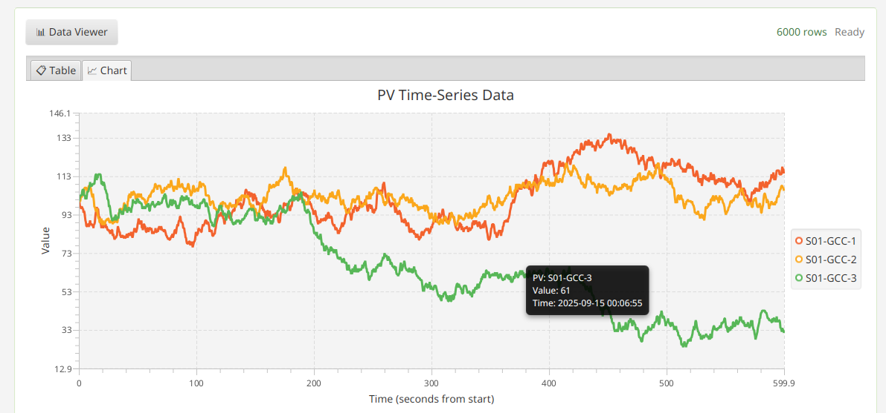

As shown in the screenshot, hovering over a point in the plot displays a tooltip with details about that point.

### Annotating archive data

A key feature of the MLDP is the ability to annotate PV time-series data in the archive.  The target for an "Annotation" is a "Dataset".  A Dataset is analogous to an Excel workbook that contains one or more worksheets.  The analog for the worksheet is called a Data Block, which describes a region of data for a list of PV names over a specified time range.  Instead of making it part of the Annotation, the Dataset is an independent entity so that multiple Annotations may target the same Dataset.  This is useful when a set of calculations derive from the same set of raw data, for example.

An important feature of Annotations is the ability to attach user-defined Calculations.  The demo application supports this feature by allowing the user to import data from an Excel spreadsheet to attach to the Annotation.  The Annotation API can be utilized to upload Calculations obtained from pretty much any data source.

To create annotations in the demo application, the user first creates a Dataset.  After saving the Dataset to the database, Annotations can be added that are linked to that Dataset.

#### Creating a Dataset

As shown in the screenshot above, the Query Editor contains a button labeled "Add to Dataset".  When the Query Editor contains a valid list of PV names and time range, the button is enabled.  When the button is clicked, a Data Block with the specified PVs and time range is created and the Dataset Builder tab is displayed.

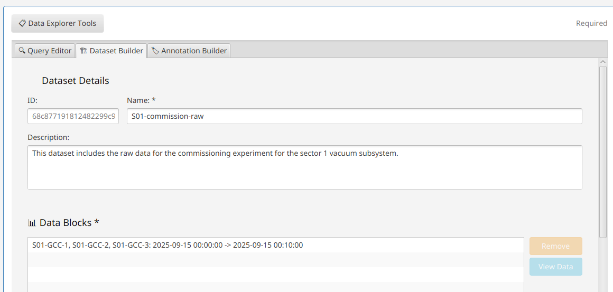
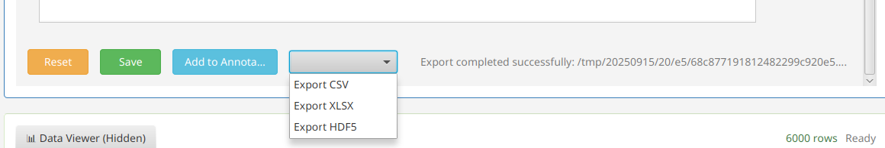

The Dataset Builder includes a form for naming the Dataset, adding a Description, and showing the unique system-generated id.  It also includes a list of Data Blocks added to the Dataset.  The Query Editor is used to add multiple Data Blocks, by entering a new PV name list and time range and the clicking "Add to Dataset".

At the bottom of the Dataset Builder is a panel of buttons.  The "Reset" button clears the contents of the Builder for creating a new Dataset. The "Save" button saves the specified Dataset via the saveDataSet() API method which adds a DatasetDocument to the Mongo "datasets" collection.  The other elements are only enabled after saving the Dataset.

There is a drop-down menu with options for exporting the Dataset to various file formats including CSV, XLSX, and HDF5.  The "Add To Annotation" button adds the Dataset to the list of linked Datasets in the "Annotation Builder" tab and the view navigates to that tab, which is described in more detail below.

#### Creating an Annotation

The Annotation Builder is used to create Annotations that are linked to Datasets.  It contains fields for the system-generated unique ID, Name, Comment, Event Name, the list of "Target Datasets" to which the Annotation is linked, lists of Tags (keywords) and Attributes (key-value pairs), and a list of imported Calculations Data Frames.

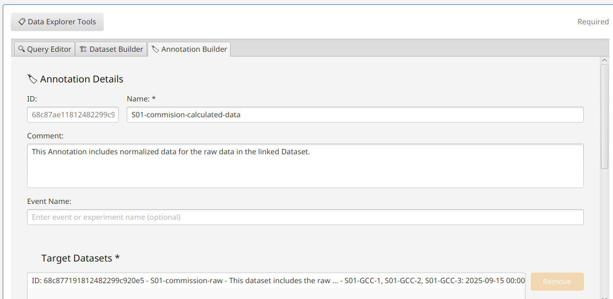
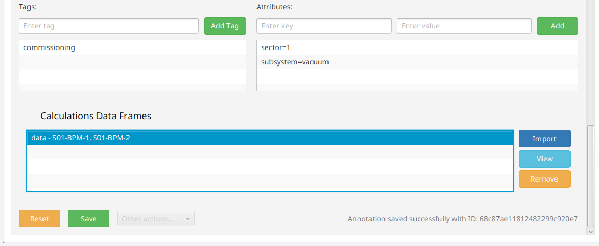

To import Calculations, click the "Import" button next to the list of Data Frames and select the appropriate Excel file from the chooser dialog.  This confirms that the file uses the exported format and imports the PV data columns for each worksheet in the file.  The expected file format for each sheet in the Excel file is the same as for importing PV time-series data in the "Import Time-Series Data" ingestion view, with includes 2 timestamp columns with one for epoch seconds and the other for nanoseconds plus an additional data column for each PV to be imported with values for each timestamp.

The "View" button opens a simple viewer with details about the data columns imported from the Excel file.  The next release will support viewing imported Calculations data alongside PV time-series data.

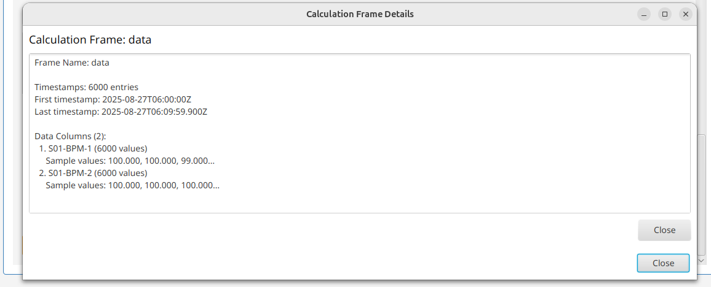

The "Remove" button removes imported Calculations Data Frames from the list.

In the button panel at the bottom of the Annotation Builder, the "Reset" button is used to clear the Builder contents for building a new Annotation.  The "Save" button uses the MLDP saveAnnotation() API method to create the Annotation in the database (specifically, it creates a new AnnotationDocument in the Mongo "annotations" collection).

### Exploring the archive

The remaining features of the demo application are for exploring the artifacts in the archive and metadata about them, as well as viewing subscription notifications.  The remainder of this section covers the Explore menu items with subsections for the menu options "PVs", "Providers", "Datasets", "Annotations", and "Data Events".

#### Exploring PVs

The "PV Explorer" view is used to add and remove PVs from the list of PV names used by the Query Editor for retrieving and viewing PV time series data, and to learn more about the PVs managed in the arhive.

To navigate to the PV Explorer, use the Explore->PVs menu item, or click the "Explore PVs" button in the Query Editor.

The "PV Explorer" view includes three sections.  

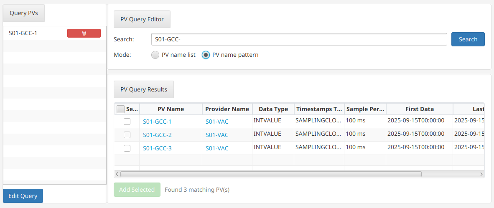

The list of "Query PVs" displayed on the left side of the view contains the current list of PVs that will be used in the Query Editor for subsequent queries. Each item in the list includes a trash can button for removing the name from the list.  The "Edit Query" button at the bottom of the list is used to return to the Query Editor with the updated list of PV names.

The top section on the right side of the view is the "PV Query Editor" which contains a single text box for entering the search criteria, and a radio button specifying whether to search using a comma-separated PV name list or PV name pattern match.  The "Search" button executes the query.

The PV query results are displayed in the "PV Query Results" section on the bottom right side of the view.  The results table includes descriptive and metadata columns including PV Name, Provider Name, Data Type, First/Last Data Times, Number of Buckets for each PV matching the query criteria.

Clicking a hyperlink in the "PV Name" column adds the corresponding PV name to the list of Query PVs.  Clicking the hyperlink in the "Provider Name" column navigates to the "Provider Explorer" view (described below), executes a search for the corresponding Provider ID, and displays results for the matching Provider.

#### Exploring Providers

The "Provider Explorer" view is to learn more about Data Providers registered in the archive, and the PVs associated with those Providers.  It can also be used to modify the list of PV names that will be used in subsequent queries from the Query Editor.

To navigate to the Provider Explorer, use the Explore-Providers menu item or select a Provider name hyperlink in the PV Explorer Query Results table.

The "Provider Explorer" view includes three sections.

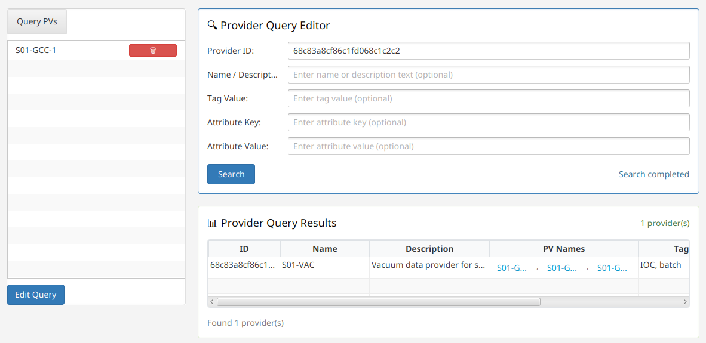

The list of "Query PVs" displayed on the left side of the view is the same as the "Query PVs" list in the PV Explorer and contains the current list of PVs that will be used in the Query Editor for subsequent queries. Each item in the list includes a trash can button for removing the name from the list.  The "Edit Query" button at the bottom of the list is used to return to the Query Editor with the updated list of PV names.

The top section on the right side of the view is the "Provider Query Editor" which contains input fields for specifying the search criteria including ID, Name/Description, Tag Value, and Attribute Key/Value.  The "Search" button executes the query.

The Provider Query results are displayed in the "Provider Query Results" section on the bottom right side of the view.  It contains a table with descriptive and metadata columns for each Provider that matched the search criteria, including ID, Name, Description, PV Names, Tags, Attributes, and Number of Buckets.

Clicking a hyperlink for a name in the PV Names column adds the corresponding PV name to the list of Query PVs.

#### Exploring Datasets

The "Dataset Explorer" view is used to search for Datasets saved in the archive.

To navigate to the Dataset Explorer, use the Explore->Datasets menu item.

The Dataset Explorer view includes two sections.

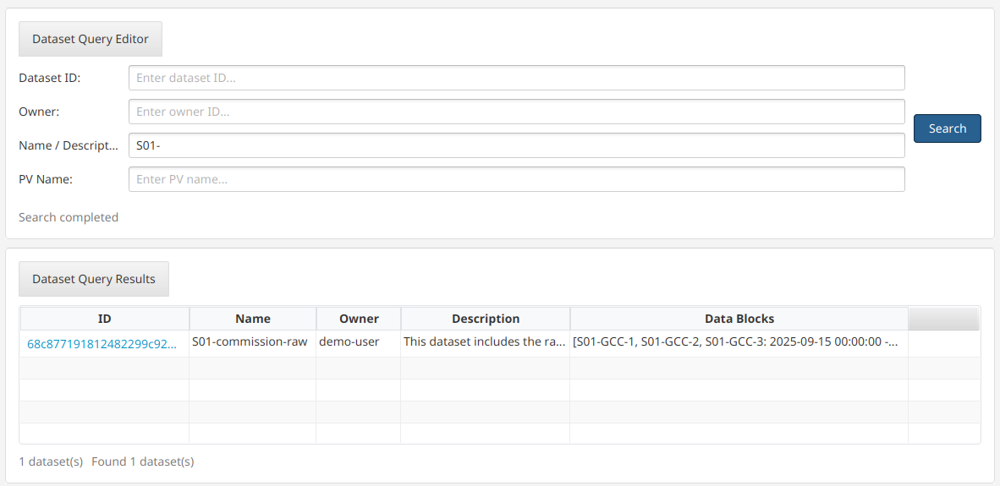

The top section is the "Dataset Query Editor".  It contains fields for specifying the search criteria including ID, Owner, Name/Description, and PV Name.  The "Search" button executes the query.

The query results are displayed in the "Dataset Query Results" section at the bottom of the view.  It contains a table with columns for each Dataset that matched the search criteria, including ID, Name, Owner, Description, and Data Blocks.

Clicking a hyperlink in the table's ID column will open the Dataset Builder, specifying details for the selected Dataset.

#### Exploring Annotations

The "Annotation Explorer" view is used to search for Annotations saved in the archive.

To navigate to the Annotation Explorer, use the Explore->Annotations menu item.

The Annotation Explorer contains two sections.

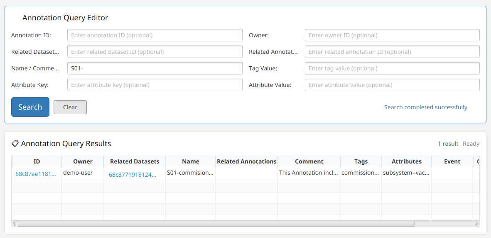

The top section is the "Annotation Query Editor".  It contains fields for specifying the search criteria including Annotation ID, Dataset ID, Name/Comment, Owner, Linked Annotation ID, Tag Value, and Attribute Key/Value.  The "Search" button executes the Query.  The "Clear" button clears the form's fields.

The query results are displayed in the "Annnotation Query Results" section at the bottom of the view.  It contains a table with columns for each Annotation that matched the search criteria including ID, Owner, Related Datasets, Name, Related Annotations, Comment, Tags, Attributes, Event Name, and Calculations Data Frame Names.

Clicking a hyperlink in the ID column opens the corresponding Annotation in the Annotation Builder.  Clicking a hyperlink in the Related Datasets column opens the corresponding Dataset in the Dataset Builder.

#### Exploring Data Events

The "Data Event Subscription Explorer" is used to manage Data Event Subscriptions, and view the event notifications triggered for a subscription by the ingested data.

To navigate to the Data Event Subscription Explorer, use the Explore->Data Events menu item.

The Data Event Subscription Explorer includes three sections.

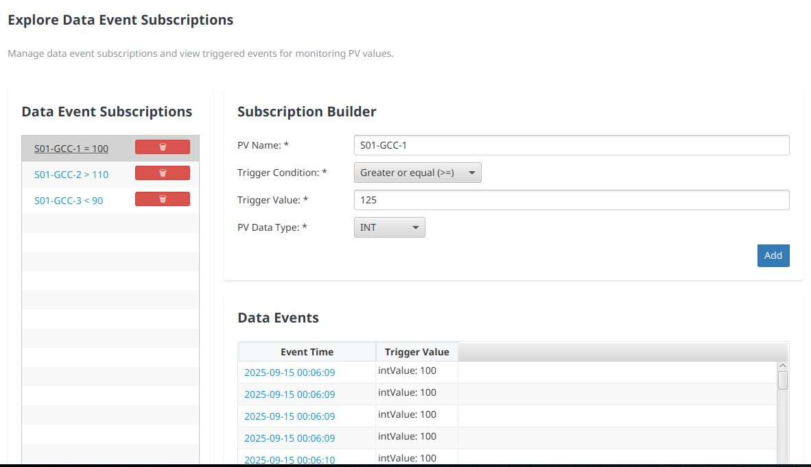

The "Data Event Subscriptins" section on the left side of the Explorer shows the current list of Data Event Subscriptions, each with a trash can button to cancel the subscription (by sending a cancel request in the subscribeDataEvent() API method request stream) and remove it from the list.  Selecting the hyperlink for a subscription shows the event notifications received for that subscription in the "Data Events" section of the view.

The "Subscription Builder" on the top right part of the view contains a form for creating a new Data Event Subscription.  It includes fields for specifying the PV Name, Trigger Condition, Trigger Value, and PV Data Type for the subscription.  Clicing the "Add" button initiates a new subscription via the subscribeDataEvent() API method and adds it to the list of Data Event Subscriptions.

The "Data Events" section on the bottom right part of the view displays the event notifications for the subscription corresponding to the link selected in the "Data Event Subscriptions" section, showing columns for the Event Time and Trigger Value (the data value that triggered the notification and the timestamp for the data value).

Clicking a hyperlink in the "Event Time" column of the Data Events table navigates to the Query Editor, populating the PV Name and Begin/End Time range using the values from the event notification (the time range for the query is set to begin 30 seconds before the time of the event and end 30 seconds after). After modifying the list of PV names and query time range as desired and clicking "Submit Query" the data for the selected event notification is displayed in the Data Viewer's Table and Chart tabs.